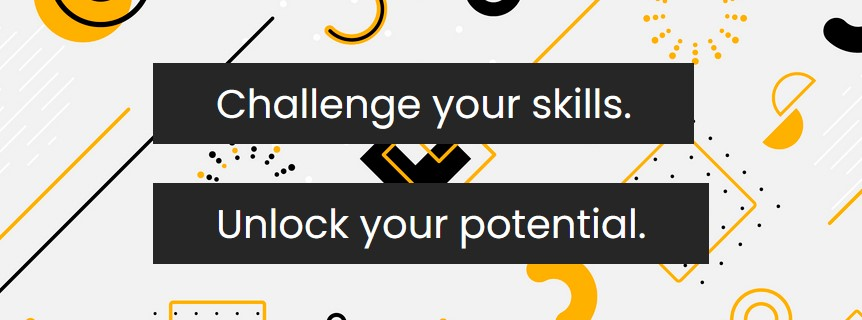

# Elemental Quests

    
  
    An innovative experience that blends the thrill of a treasure hunt with the power of storytelling and puzzles to provide a one-of-a-kind soft skills assessment experience.

# Features

Listed below are all the feature included in the project

## Game Feature

- [x] 5 stages of game
    1. Octet lock
    2. Odd Drawers
    3. Atomic shell
    4. Quartz Quary
    5. Mindful Molecules
- [x] 8 soft skills assessed
    1. Critical Thinking
    2. Memory
    3. Patience
    4. Focus
    5. Stress Management
    6. Problem Solving
    7. Eye for Detail
    8. Emotional Intelligence
- [x] 2 dead ends
    1. First on stage 4: Quartz Quary
    2. Second on stage 5: Mindful Molecules
- [x] 10 clues
- [x] User leader board
- [x] Admin Panel
- [x] User analytics after game ends
- [x] Overall and each user's analyticals in admin panel
- [x] 404 page (route not present error)
- [x] 403 page (insufficient authorization)

## Authentication

- [x] User Sign up
- [x] User Sign in
- [x] Forgot Password (reset password via email)
- [x] admin login

## Authorization

Only logged in users can:
- [x] Play game
- [x] Access user leader board
- [x] Access result analysis
- [x] Only admin can access Admin Panel

# Detailed view of the game

The project has been developed as a way to test soft skills, thus it is only one time play for every user.

## Completion of the game

- The game meant to test the soft skills, thus keeping user stuck on level for ever with no form of rescue is futile.

- To avoid this *Special actions:* **skip** and **End Game**, are available at each stage so user can skip the stage by discarding the points or end the game if required.

## General Instructions for the game are as follows:

- The purpose of this game set is to evaluate your soft skills

- We recommend completing all games in one sitting, as the game is designed to be played only once

- Points are awarded for correct answers and time taken to solve each game

- The timer will not be visible on screen

- In the event of an emergency such as a power outage, technical difficulties, or network issues, you may resume the game from where you left off

- Timer will continue on the server but your progress won't be lost

- Please be attentive to all information presented in the game

- If you find yourself at a dead end, you can choose to review the previous stage, which may provide clues to help you progress past the current stage

- If necessary, you have the option to skip a stage, though this will result in forfeiting any potential points for that stage

- You may end the game at any time, regardless of what stage you are on and receive results till there

# Stage 1: Octet Lock

## Soft skills tested

## Dead end

## Clues

## Story

## Puzzle

## Solution

## Motive

# Tech stack:

## Frontend

## Backend

## Database and Authentication

## Hosting 

# Project Set-up
## Install Node
- #### Node installation on Windows

  Just go on [official Node.js website](https://nodejs.org/) and download the installer.
Also, be sure to have `git` available in your PATH, `npm` might need it (You can find git [here](https://git-scm.com/)).

- #### Node installation on Ubuntu

  You can install nodejs and npm easily with apt install, just run the following commands.

      $ sudo apt install nodejs
      $ sudo apt install npm

## Install Project

    $ git clone https://github.com/jhamadhav/elementalQuests.git
    $ cd elementalQuests
    $ npm install

## Configure Project

This project uses Firebase technology, to configure this project for your self create project on firebase and replace credentials at required locations

# Credits
izitoast: https://izitoast.marcelodolza.com/

moving background: https://codepen.io/kootoopas/pen/kGPoaB
